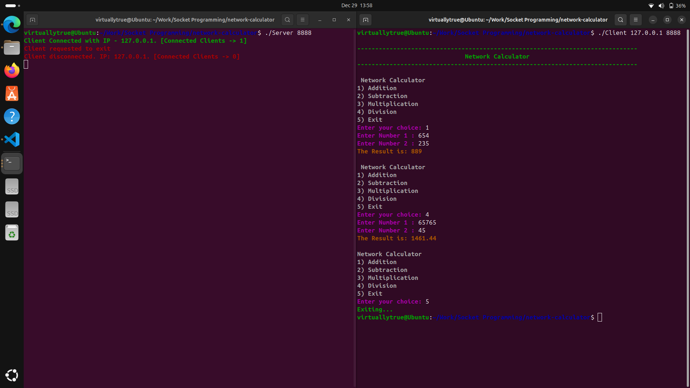
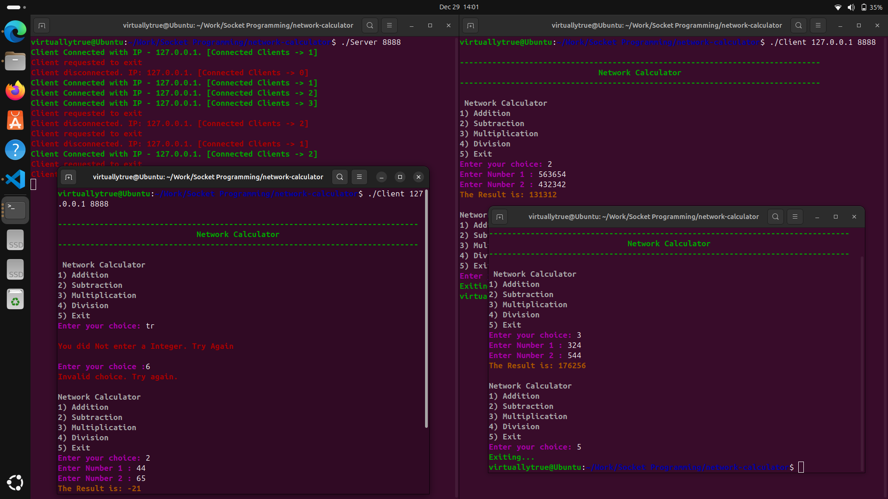

# Network Calculator Project

A simple network-based calculator program, using a client-server model. The server accepts connections from clients and performs arithmetic operations (addition, subtraction, multiplication, and division) based on the client's input. The project includes multi-threading for handling multiple clients simultaneously and ensures the server doesn't crash when processing multiple requests.

## Features

- **Menu-driven calculator:** The client can choose an operation (addition, subtraction, multiplication, and division) and enter two numbers.
- **Network Communication:** The communication between the client and server is done using sockets.
- **Multi-threading:** Each client is handled in a separate thread, allowing multiple clients to interact with the server simultaneously.
- **Client-Server architecture:** The client sends requests to the server, and the server processes them and sends back the results.
- **Simultaneous Client Connections:** The server can handle multiple clients at the same time without crashing, ensuring robust performance.
- **Server Notifications:** The server sends notifications when a new client connects or disconnects, displaying the client's IP address and the total number of connected clients.

## Technologies Used

- **C Programming Language**
- **Sockets (TCP/IP)**
- **Threads (Pthread)**
- **Basic Arithmetic Operations**

## Server Notifications
- When a client connects, the server will notify the administrator with the IP address of the client and the total number of clients connected.
- When a client disconnects, the server will notify the administrator with the client’s IP address and the updated total number of connected clients.

## Server Resilience
The server is designed to handle multiple clients without crashing, even when many clients connect and disconnect. Each client is handled in a separate thread, ensuring that one client’s disconnection or any unexpected error doesn’t affect other clients or the server itself

## Project Structure

The project consists of two main parts: the **client** and the **server**. Below is the structure of the files:

```bash
network-calculator/
├── Client.c # Client-side code
├── Server.c # Server-side code 
├── README.md # Project documentation 
```

### Client.c

This file contains the client-side code that establishes a connection with the server, sends user input, and displays the results of the calculations.

### Server.c

This file contains the server-side code that listens for incoming client connections, processes the client requests, and sends back the results.

## How to Run

### 1. Clone the Repository

First, clone the repository to your local machine.

```bash
git clone https://github.com/yourusername/network-calculator.git
cd network-calculator
```
### 2. Compile the Code

You can compile the client and server running the following command in terminal.
```bash
gcc Server.c -o Server
gcc Client.c -o Client
```

### 3. Run the Server
Start the server by running the following command in one terminal window:
```bash
./Server <port>
```
Replace <port> with the port number you want to use (e.g., 8080).

### 4. Run the Client

Now, start the client by running the following command in another terminal window:
```bash
./Client <server-ip> <port>
```
Replace <server-ip> with the IP address of the server machine and <port> with the same port number used by the server.

### 5. Disabling Firewall (if using different machines for Server and Client)
If you are running the client and server on different machines, and the client is unable to connect to the server due to firewall restrictions, you can disable the firewall temporarily on the server machine by running the following command:

```bash
sudo ufw disable
```
This will disable the firewall, allowing incoming network connections. Use this with caution, as it will make the machine more vulnerable to external network attacks.

To re-enable the firewall later, you can run:

```bash
sudo ufw enable
```


### Example
#### 1. If using same machines for Server and Client
```bash
./Server 8080
```
```bash
./Client 127.0.0.1 8080
```
### 1. If using different machines for Server and Client
```bash
./Server 8888
```
```bash
./Client 192.168.1.39 8888
```

### 6. Interacting with the Program
Once the client is connected to the server, you can interact with the menu as follows:
#### 1. Choose the operation:
```bash
1) Addition
2) Subtraction
3) Multiplication
4) Division
5) Exit
```
#### 2. Input two numbers when prompted.

#### 3. The server will send back the result of the operation.

#### Example Client Output
```bash
Connected to the Network Calculator

Network Calculator
1) Addition
2) Subtraction
3) Multiplication
4) Division
5) Exit
Enter your choice: 1
Enter Number 1 : 5
Enter Number 2 : 3
The Result is: 8
```

#### Example Server Output
```bash
Client Connected with IP - 192.168.1.2. [Connected Clients -> 1]
Client Connected with IP - 192.168.1.3. [Connected Clients -> 2]
Client disconnected. IP: 192.168.1.2. [Connected Clients -> 1]
```
## Screenshots
### Only one client connected to the Server

### Multiple Clients connected to the Server

